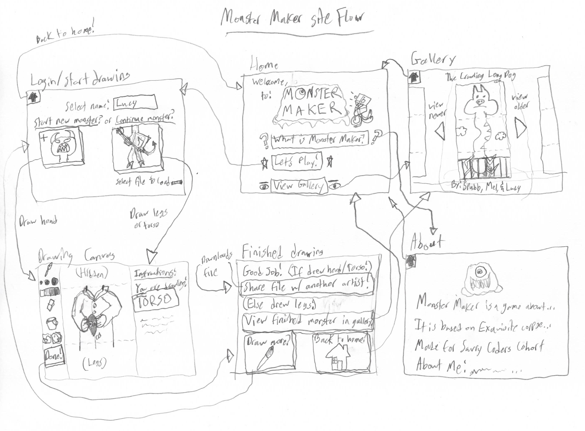

# Capstone Project Planning Week 1 Homework

### Please complete each section below

- Write a Definition Statement
  - I want to build an application that...
    - **Allows users to play an art game similar to "Exquisite Corpse"**
- Define your Audience
  - Who is using my application
    - **Artists of all skill calibers.**
- Outline the content of the application
  - What do I want on each page?  (text / pics / images / navigation)? What do I want the functionality of each page to be?
    - **See MonsterMakerSiteFlow.pdf and mural**
  - What is the purpose of my application?
    - **Monster Maker will be for entertainment, and as a fun drawing exercise.**
  - What business problem or real world problem am I going to be solving?
    - **MM will help artists to have fun with drawing, and overcome art block.**
  - Define the attributes of your website
    - Color Palette
      - **Lime green and cherry red**
    - Images
      - **Mascot (and my 'sona): Prezzy**
      - 
    - Fonts
      - **Permanent marker font drawn by yours truly**
    - Logos
      - 
    - Navigation
      - **Navigation done primarily through top menu bar**
- Create and provide link to [User Story Map](https://app.mural.co/template/c5cae3de-aeb4-487f-86da-35aa333d11f6/9ee833d5-2629-40ea-a239-6308d3a60980) in Mural
  - **[Mural link](https://app.mural.co/t/lucynlucy0112/m/lucynlucy0112/1732157565698/6e9c07b5b911d473e20657ea1108e19b18b64feb?sender=u48a81d8343739c23db1b6938)**
- Research the following:
  - List Applications Researched: (links to websites / applications)
  - List what you like about each site:
  - List what you do not like about each site:
  - How my application will be different:
- **Researched sites:**
  - [Pictochat](https://pict.chat/)
    - Likes:
      - Faithful recreation of the Nintendo DS's Pictochat drawing/chatting game
      - Nostalgic!
    - Dislikes:
      - Kind of disorganized
      - Seems difficult to moderate/scale up
  - [Play Exquisite Corpse](https://www.playexquisitecorpse.com/)
    - Likes:
      - A good adaptation of the original art game into web format
      - Has a gallery of other players' work
    - Dislikes:
      - Creations often have different color schemes
      - Due to the online nature, some of the drawings are crude
  - **How my applicaiton will be different:**
    - Will keep drawing controls as simple as possible
    - Drawings might be limited to color palettes chosen by the person drawing the head
    - Person drawing torso gets... something
    - Person who draws legs gets to name the monster based on adjectives/nouns supplied by previous two players
    - May have an option to let players rate their drawings as "adult" so that other players can choose to filter NSFW drawings

- Create wireframes and provide link for each page (minimum of 4-5 pages) including Home, About Me, Contact Us and 1-2 other pages demonstrating the specific functionality of your capstone's purpose
  - 
- Create and provide link to User Flow Diagram
  - **User flow also included in wireframe above**
- Create and provide link to [SWOT Analysis](https://docs.google.com/document/d/1K5ix6TZr2l2LnPKNnVj8PRzfkQoVlEwFBbynrA5aj44/edit?usp=sharing)
  - **[SWOT Analysis link](https://docs.google.com/document/d/1isojqiimzSG09qzsYrjaiKxq6t2WHYwBbiHigMewpcw/edit?usp=sharing)**

## Submitting *Week 1* Homework, this is due to your TA by End of Day (EOD) Sunday before Week 4
